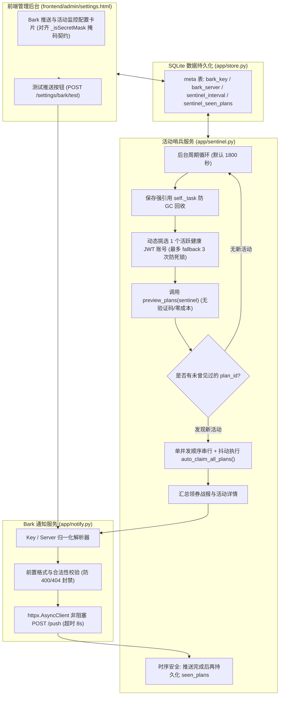

# Bark 活动监控与智能领券技术方案与架构设计

> 版本：v1.1（已通过 Antigravity 对抗审查并收敛 P1/P2 缺陷）  
> 日期：2026-09-28  
> 设计理念：第一性原理 · 归一化 · 二阶思维  
> 核心约束：本期只做 Bark 推送 · 零新增重量第三方依赖 · 只用免费赠送额度 · 保持代码与文档风格高度一致

---

## 1. 业务背景与问题定义

### 1.1 现状与痛点
ZCode2API 项目的核心宗旨是**不订阅、仅充分利用官方免费赠送额度（如 GLM-5.3-Flash）**。
然而官方平台通常会在特定节日、节点或运营活动中限时投放高额度免费套餐（如 500 万 Token 的限时礼包）。此类活动具有两大特性：
1. **时效性与名额限制**：活动往往有名额上限（容易遭遇 1005 名额已满）或极短的领取窗口期。
2. **人工监控滞后**：用户无法全天候盯守控制台刷新，容易错失免费资源。

### 1.2 目标定位
- **第一时间通知**：在官方发布新套餐后，网关在设定周期内（默认 1800 秒 / 30 分钟）迅速察觉，并通过 Bark 将活动明细推送至用户 iOS 设备。
- **全自动闭环（二阶跃迁）**：不仅停留在“发消息等人工处理”，而是在发现新活动的第一时间，自动为账号池内所有有效 JWT 账号**顺序串行（带抖动保护，防止打崩验证码预解池）**抢领套餐，将“活动通知 + 全池抢领战报”合并送达，极大化保障薅到额度。
- **轻量与稳定性**：纯异步旁路运行，零额外重量库，推送失败不影响 API 核心路由，杜绝告警风暴与上游封控。

---

## 2. GitHub 与同类开源项目调研与借鉴

经过对 GitHub、X 及 Bark 生态（如 `Finb/Bark` 官方规范、各类签到通知中间件、限时抢券机器人）的调研，总结最具参考价值的方案与避坑要点：

### 2.1 推荐复用的设计
1. **统一采用 POST JSON 规范**：
   - 避免使用 GET 路径拼接（`https://api.day.app/{key}/{title}/{body}`），因为长文本、套餐换行符、JSON 摘要、中文字符在 URL 编码下极易引发 414 URI Too Long 或乱码。
   - 统一使用 `POST https://api.day.app/push`，并在 Body 中携带 `device_key`, `title`, `body`, `group`, `sound`, `isArchive`, `url`。
2. **Key / Server 归一化解析器**：
   - 开源实践中用户填写的配置格式五花八门：有的填裸 Key（`abcd1234`），有的填官方全链接（`https://api.day.app/abcd1234/`），有的填自建 Bark 服务（`https://bark.myhost.com/abcd1234`）。
   - 必须在底层提供鲁棒的正则/URL 归一化算法，自动分离并规范化 `(server_url, device_key)`，彻底杜绝配置格式问题。
3. **哨兵探测模式 (Sentinel Pattern)**：
   - 多账号管理类开源项目中，若有 20 个账号同时轮询上游的公共活动列表，会产生 20 倍无意义的网络开销与被风控风险。
   - 借鉴成熟的哨兵模式：因为活动对全站所有账号是公开且一致的，**只需选派 1 个活跃账号作为“哨兵（Sentinel）”** 进行低频拉取（无验证码、无消耗），开销趋近于 0。

### 2.2 必须避开的严重大坑与二阶防御设计
1. **大坑 1：Bark 官方 400/404 频控与 IP 封禁**：
   - Bark 官方明确声明，若客户端持续向其发送格式非法（如空 Key、无效 Key 长度）的 400/404 请求，发送方公网 IP 会被 Bark 临时或永久拉黑。
   - **对策**：在发起网络请求前，强制进行本地静态格式检验（如 device_key 字符集与长度校验）；未配置或格式非法时短路返回，不发真实网络请求。
2. **大坑 2：告警风暴（Alarm Storm）**：
   - 若某活动持续有效数天，每 30 分钟轮询一次，如果没有状态去重，用户将连续收到成百上千条完全相同的通知，导致被用户静音。
   - **对策**：在 SQLite `meta` 表中持久化已见活动集合（`sentinel_seen_plans`）。每次探测与持久化集合做差量对比，**仅当出现全新 `plan_id` 时才触发通知**。
3. **大坑 3：并发抢领击穿验证码预解池与 Node Solver 拥堵（Antigravity 审查核心发现）**：
   - 套餐领取必须依赖阿里云无痕验证码求解器，系统的预解池容量为 3~10 个，Node.js 求解单次耗时 2~5 秒。若池内数十个账号并发抢领，会瞬间掏空预解池并引发 Node 进程爆炸和上游滑块拦截。
   - **对策**：**绝对禁止全并发抢领**！强制采用**单并发顺序串行循环**（`for acc in active_jwt_accounts`），且账号之间加入轻量随机抖动延时（`await asyncio.sleep(random.uniform(0.6, 1.5))`）；同时严格通过 `is_claim_blocked()` 跳过避让期账号。
4. **大坑 4：哨兵账号 401 自愈死循环与全池连坐（Antigravity 审查核心发现）**：
   - 若哨兵遇到 401 就无限制切下一个，若遭遇全网鉴权失效或网络阻断，可能把池内正常账号一次性全部误判为 `INVALID` 或死循环。
   - **对策**：显式设置单轮最大探针上限 `max_probe_retries = min(3, len(active_accounts))`。若连续 3 次探针均 401 失败，立即终止本轮巡检，记录严重日志并可选推送一次凭证失效告警，绝不连坐全池。
5. **大坑 5：先落库后推送导致新活动通知“静默丢失”（Antigravity 审查核心发现）**：
   - 若先持久化 `seen_plans` 再发通知，中途若推送超时或服务重启，由于已落库，后续巡检将视为已知活动，导致用户永远收不到通知。
   - **对策**：**采用安全的时序策略**：在组装好战报、成功调用 `send_bark_notification` 之后（或重试降级完成后的 finally 阶段），再将新 `plan_id` 提交持久化；若 Bark 推送因网络故障失败，记录日志并在下一周期补偿重试 1 次。

---

## 3. 系统架构设计

### 3.1 架构分层图

### 3.2 模块职责与接口定义

1. **`app/notify.py`（Bark 通知引擎）**：
   - `normalize_bark_config(raw_input: str, default_server: str = "https://api.day.app") -> tuple[str, str]`：
     输入任意形式输入（裸 Key、官方链接、自建域名链接），输出归一化的 `(server_url, device_key)`。
   - `is_valid_bark_key(device_key: str) -> bool`：
     前置静态校验（长度 >= 10，仅含合规 Base62 字符），避免非法 Key 导致官方封禁 IP。
   - `async def send_bark_notification(title: str, body: str, group: str = "ZCode监控", url: str | None = None) -> tuple[bool, str]`：
     从 `store` 获取配置，校验有效性，使用异步非阻塞 `httpx` 发送（`timeout=8.0`）。全量异常捕获，绝不向上抛出异常。
2. **`app/sentinel.py`（哨兵巡检与智能抢领调度器）**：
   - 单例生命周期：提供 `start()` 与 `stop()`。内部显式定义 `self._task: asyncio.Task | None = None` 保持强引用，防 Python GC 静默回收。
   - 健壮巡检逻辑：
     1. 从 `store.list_accounts("zai")` 查找满足 `mode == "jwt"` 且 `status == Status.ACTIVE` 且 `not is_claim_blocked()` 的账号。
     2. 最多允许 fallback `min(3, len(candidates))` 次；若遇到 401 标记失效并换下一个；若全部失败则中止本轮巡检并记录日志。
     3. 执行 `preview_plans(sentinel_account)` 获取最新套餐列表。
     4. 与 `store.get_seen_plan_ids()` 进行差集比对：`new_plans = [p for p in plans if p["plan_id"] not in seen_ids]`。
     5. 若 `new_plans` 非空：
        - 若开启自动抢领（默认开启）：以**单并发顺序串行**遍历全部可用 JWT 账号，中间穿插 `0.6~1.5s` 抖动延时，调用 `auto_claim_all_plans`；
        - 组装格式规整的 Bark 聚合消息；
        - 调用 `send_bark_notification` 异步推送；
        - 成功推送后，更新 `store.add_seen_plan_ids(...)` 提交持久化落库。
3. **`app/store.py`（存储扩展）**：
   - 在 `meta` 表中新增并维护：
     - `bark_device_key`：Bark 设备 Key（脱敏掩码与落库管理）。
     - `bark_server_url`：Bark 服务器地址（默认 `https://api.day.app`）。
     - `bark_enabled`：是否启用 Bark 推送（`1` 或 `0`）。
     - `sentinel_interval`：巡检间隔（秒，默认 1800，0 为停用）。
     - `sentinel_auto_claim`：发现新活动是否自动抢领（`1` 或 `0`，默认 `1`）。
     - `sentinel_seen_plans`：已发现并通知过的 plan_id JSON 列表。
4. **`app/routes/admin_api.py` 与 `frontend/admin/settings.html`**：
   - `/settings` GET 接口返回 `bark_device_key_masked`（使用系统统一的 `_mask_secret`），PUT 接口支持 `_isSecretMask` 忽略未修改原值。
   - 新增 `/settings/bark/test` POST 接口：供前端点击“发送测试消息”验证连通性。
   - 前端新增独立卡片“活动监控与 Bark 通知”，具备即时测试与状态反馈。

---

## 4. 关键设计推演（第一性原理 · 归一化 · 二阶思维）

### 4.1 第一性原理（First Principles）
- **成本与流量最小化**：
  上游活动是广播式的，不需要所有账号重复轮询。单账号 `preview` 仅耗费 1 次轻量只读 GET，无需阿里云验证码 Token，不调用 solver 进程，对网关性能消耗为 0，对上游风控隐蔽性极高。
- **纯粹性**：
  不依赖任何外部推送平台或重型通知库（不依赖 celery、apscheduler、pushbullet 等），直接利用已有的 `asyncio` 与 `httpx`，纯代码量预计在 200 行以内，轻盈紧凑。

### 4.2 归一化（Normalization）
- **输入归一化**：
  用户在 UI 填入的各种形式统一被处理为：
  `server_url = "https://..."`，`device_key = "..."`。
  无论是结尾有无 `/`、是官方还是自建、带不带查询参数，均一键归一化。
- **消息结构归一化**：
  Bark 推送统一使用：
  - Title：`🎉 发现 ZCode 新活动 / 🎁 活动领券战报`
  - Group：`ZCode活动`
  - Sound：`minuet`
  - Archive：`1`（保存历史记录以便查阅）
  - URL：指向本地后台账号页（如 `http://<ip>:<port>/admin/accounts`）

### 4.3 二阶思维（Second-Order Thinking）
- **二阶推演 1：持久化差量去重**
  如果在 SQLite `meta` 表中持久化已见活动集合，即使服务重启，也不会对已知活动二次告警，彻底避免告警风暴。
- **二阶推演 2：感知即抢领（顺序串行保护）**
  自动抢领采用单并发串行 + 抖动，既能在数秒内为全池锁定名额，又彻底保护了验证码求解器不被击穿。
- **二阶推演 3：哨兵健康自愈与最大重试限制**
  单轮探测最多切换 3 次健康账号，遇 401 标记失效，超出上限立即中止，杜绝全池连坐与死循环。
- **二阶推演 4：Bark 网络故障隔离与落库时序安全**
  Bark 推送设严格的 8 秒超时，异常不影响任何其他组件；推送完成后再持久化 `seen_plans`，防止新活动通知静默丢失。

---

## 5. MVP 范围与非目标

### 5.1 MVP 核心范围（本期交付）
1. **Bark 通知模块 (`app/notify.py`)**：
   - 健壮的 URL 与 Key 归一化解析器。
   - 异步 POST JSON 请求发送，前置合规检查与超时熔断保护。
2. **活动哨兵与抢领闭环 (`app/sentinel.py`)**：
   - 强引用后台任务防 GC。
   - 动态单哨兵调度与 3 次上限健康自愈轮换。
   - 套餐差量探测与 SQLite `meta` 表已见套餐时序安全持久化。
   - 单并发串行抖动触发全池 `auto_claim_all_plans`。
   - 结构化战报组装与推送。
3. **管理后台设置与测试联调 (`admin_api.py` + `settings.html`)**：
   - 支持配置 Bark Key/Server、巡检周期、自动抢领开关，符合掩码规范。
   - 提供“测试推送”接口与按钮，快速验证联调。
4. **完备的自动化测试与文档同步**：
   - 覆盖 URL 归一化、Bark 响应分支、差量去重逻辑、哨兵动态挑选等场景的单元测试。
   - 更新架构文档与设计规范。

### 5.2 明确的非目标（Out of Scope）
- **本期不做其他通知渠道**：如 Telegram Bot、企业微信、飞书、Server酱、邮件等（严格按用户指令，只做 Bark）。
- **不做复杂的定时 Cron 语法配置**：仅使用秒级/分钟级整数间隔，简单易懂。

---

## 6. 开发顺序与执行步骤

1. **第一步：基础通知层与单测实现**
   - 编写 `app/notify.py`：实现归一化解析、前置有效性校验、非阻塞推送。
   - 编写 `tests/unit/test_notify.py`：全量覆盖各种合法/非法 URL 与 Key 格式解析、Mock 网络成功与失败分支。
2. **第二步：存储层与后台配置端点**
   - 在 `app/store.py` 中添加 Bark 与 Sentinel 相关配置项读取、保存及 `seen_plans` 集合持久化方法。
   - 在 `app/routes/admin_api.py` 扩充 `/settings` 读写（带掩码保护）及新增 `/settings/bark/test` 端点。
3. **第三步：哨兵巡检调度器与自动抢领闭环**
   - 编写 `app/sentinel.py`：实现单例生命周期（强引用防 GC）、动态哨兵选择（3 次上限）、preview 探测、差量检测、单并发串行自动抢领联动与战报拼装。
   - 在 `app/main.py` 的 lifespan 中挂载 `sentinel.start()` 与 `await sentinel.stop()`。
   - 编写 `tests/unit/test_sentinel.py`：对哨兵挑选、活动去重、差量判定、异常容错进行隔离测试。
4. **第四步：前端设置页面交互**
   - 在 `frontend/admin/settings.html` 增设“活动监控与 Bark 通知”卡片，包含 Key/Server 输入、刷新间隔、自动抢领开关与“测试推送”按钮。
5. **第五步：端到端集成测试与 Antigravity 终审**
   - 执行 pytest 全量回归测试，确保新功能 100% 绿灯且原有 47 个测试无任何退化。
   - 通过 `agent-acp-bridge` 派发 Antigravity（角色：`code-reviewer`）执行终审。
